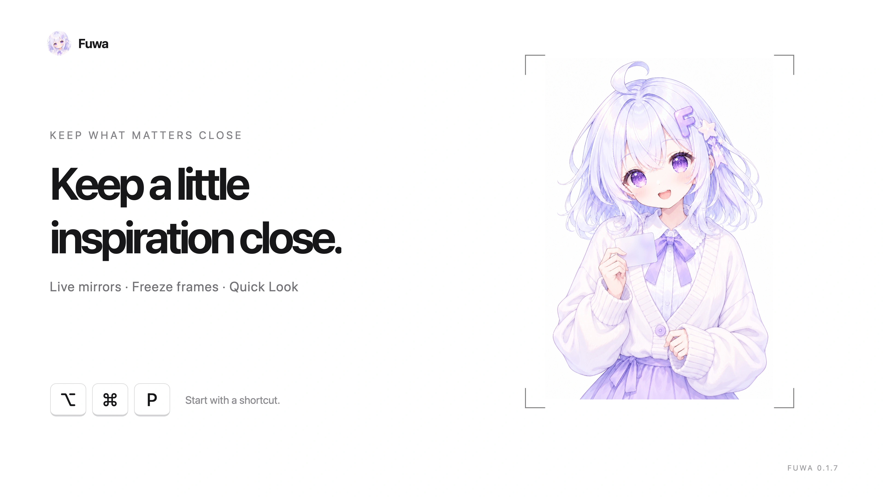

<div align="center">
  
  <h1>Fuwa</h1>
  <p>Keep the window you need in front.</p>
  <p>
    <a href="https://fuwa.yuxino.cn"><strong>Official website</strong></a>
    · <a href="https://github.com/yuxino/fuwa/releases"><strong>View releases</strong></a>
    · <a href="README_ZH.md">简体中文</a>
  </p>
</div>

Fuwa is a native macOS menu bar app that creates an always-visible, click-through live mirror of an application window or Finder Quick Look, without changing the source window's real z-order.

## Full feature tour

109 seconds · 4K · 60 fps · English female narration. Pin a reference, work beneath a live mirror, freeze and resume, manage several windows, and use Finder Quick Look.

<details>
<summary>
  <picture></picture>
  <br><strong>Expand to watch here · 4K / 60 fps · English</strong>
</summary>

https://github.com/user-attachments/assets/e4168306-13da-4f69-bb3d-f75c2cd88d54

</details>

The Chinese and English native interactions were filmed separately with a dedicated recording copy. [Capture notes](docs/demos/fuwa-full-tour-provenance.json) describe the framing adaptations; [watch the Chinese version](README_ZH.md#完整功能演示).

## Use

1. Launch Fuwa and bring the target window to the front.
2. Press `⌥⌘P` to pin it. Press the shortcut again while the same source is in front to unpin.
3. Manage pins and live or frozen state from the menu bar.

## Features

- Pin multiple windows and freeze frames.
- Support for ordinary application windows and Finder Quick Look.
- Customizable keyboard shortcut.
- Mirrors pass mouse input through; `Interact` and `Reveal Source` only activate and raise the real source window.
- Window pixels and metadata stay on your computer, with no uploads, analytics, or telemetry.
- Check, download, and install Ed25519-verified updates from Settings. No automatic background checks or installs.

## Requirements

- macOS 14 or later; the release archive includes arm64 (Apple silicon) and x86_64 (Intel). Physical Intel Mac acceptance is still pending.
- Screen Recording permission, requested only on the first pin attempt.
- Accessibility permission, requested only for `Interact` or `Reveal Source`.

## Install

Download `Fuwa-<version>.zip` from [GitHub Releases](https://github.com/yuxino/fuwa/releases), extract it, and move `Fuwa.app` to `/Applications`. Every public package has a matching `.sha256` file:

```sh
cd ~/Downloads
shasum -a 256 -c "Fuwa-<version>.zip.sha256"
```

Replace `<version>` with the actual version number. Versions v0.1.4 and earlier need one manual upgrade to v0.1.5 or later. After that, select `Check for Updates` in Fuwa Settings. Fuwa accepts only its fixed GitHub feed and packages verified by the embedded public key; verification failure never falls back to unsigned installation.

The macOS package uses the project's maintained local signing identity, not Apple Developer ID signing or notarization. If macOS blocks it, verify the source and SHA-256 and follow [Apple's instructions](https://support.apple.com/guide/mac-help/open-a-mac-app-from-an-unknown-developer-mh40616/mac), rather than weakening system security.

## Build from source

Fuwa uses Swift, SwiftUI/AppKit, ScreenCaptureKit, and Sparkle.

```sh
git clone https://github.com/yuxino/fuwa.git
cd fuwa
./scripts/setup-local-signing.sh
./scripts/install-app.sh
```

## Platform scope

Fuwa is now maintained for macOS only. Windows development and releases have ended. Existing Windows release files and Git history remain available as unsupported archives; future macOS releases will not provide Windows installers or update feeds.

Fuwa displays a mirror, not a change to another app's real window level. It does not bypass operating-system security boundaries or protected-content restrictions.

[Privacy](PRIVACY.md) · [Contributing](CONTRIBUTING.md) · [Security](SECURITY.md) · [Independent implementation](docs/independent-implementation.md)

## License

[MIT](LICENSE) © 2026 yuxino and Fuwa contributors
