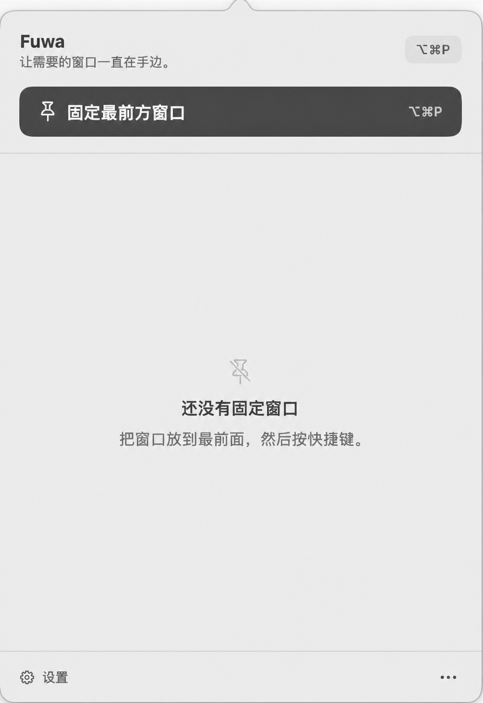

# Fuwa

[English](README_EN.md)

Fuwa 是一个本地优先的 macOS 菜单栏工具：把当前窗口变成始终可见的实时镜像，不修改其他 App 的窗口层级。



## 功能

- 按 `⌥⌘P` 固定或取消固定前台 App 中的目标窗口；快捷键可在设置中修改。
- 使用 ScreenCaptureKit 精确捕获普通窗口与 Finder Quick Look 等临时窗口。
- 同时保留多个 Pin，并可在实时画面与冻结画面之间切换。
- 源窗口关闭后，已取得完整画面的 Pin 会保留最后一帧。
- 镜像默认不拦截鼠标。`Interact` 与 `Reveal Source` 只通过辅助功能激活并抬升真实源窗口，不读取、转发或注入输入事件。
- 不联网、不含遥测，窗口画面只在本机内存中处理。
- 锁屏、睡眠、切换用户或退出 Fuwa 时立即停止捕获并清除保存的像素。

## 系统要求

- macOS 14 或更高版本
- 屏幕录制权限（固定窗口时需要）
- 辅助功能权限（仅使用 `Interact` 或 `Reveal Source` 时需要）

## 安装

发布版可从 [GitHub Releases](https://github.com/yuxino/fuwa/releases) 获取。

首个 `v0.1.0` 是公开预览版，采用 ad-hoc 签名，尚未经过 Apple Developer ID 签名和公证。下载前可以核对 Release 中的 SHA-256 文件。首次打开被 Gatekeeper 拦截时：

- macOS 15 或更高版本：先尝试打开一次，再前往“系统设置 → 隐私与安全性”，在“安全性”区域选择“仍要打开”。
- macOS 14：在 Finder 中右键 Fuwa，选择“打开”，再确认一次。

这是 Apple 为未公证 App 提供的手动例外；只应在你确认下载来源与校验和后使用。参见 [Apple 官方说明](https://support.apple.com/guide/mac-help/open-a-mac-app-from-an-unknown-developer-mh40616/mac)。

```sh
shasum -a 256 -c Fuwa-0.1.0.zip.sha256
```

也可以从源码构建：

```sh
git clone https://github.com/yuxino/fuwa.git
cd fuwa
./scripts/setup-local-signing.sh  # 每台 Mac 只需一次
./scripts/install-app.sh
```

`install-app.sh` 会把 Fuwa 固定安装到 `/Applications/Fuwa.app`，并在每次更新前核对完整代码身份。脚本优先使用 Apple Development 身份；没有时使用同一台 Mac 上长期保留的 `mimi Local Development` 本机身份。两者都能避免重建后被 macOS 当成另一个 App。它们不代表 Developer ID 签名或 Apple 公证。

从 `v0.1.0` 的 ad-hoc 包迁移到稳定签名时，macOS 仍会要求最后授权一次；这是身份切换本身造成的，后续原位更新不会再重复。若 `/Applications/Fuwa.app` 已存在，需仅在这次迁移中明确允许：

```sh
FUWA_ALLOW_IDENTITY_CHANGE=1 ./scripts/install-app.sh
```

打包脚本始终拒绝 ad-hoc 签名；没有稳定身份时不会生成可运行的 `.app` 或压缩包。

## 使用

1. 启动 Fuwa；它只出现在菜单栏，不显示 Dock 图标。
2. 将想要固定的窗口置于最前方，按 `⌥⌘P`。
3. 继续对其他窗口执行同样操作即可创建多个 Pin。
4. 从菜单栏面板中 Freeze、Resume、Interact、Reveal Source 或 Unpin。

首次固定窗口时，macOS 会请求屏幕录制权限。首次明确选择 `Interact` 或 `Reveal Source` 时，Fuwa 才会说明并请求辅助功能权限。授权后如果系统提示需要重新打开 App，请退出并重新启动 Fuwa。

Fuwa 对每一种系统权限只发起一次请求。拒绝后再次操作只会保留设置引导，不会循环弹出系统授权窗。

## 工作方式

Fuwa 使用公开的 macOS API 合并前台 App、WindowServer 前后顺序与 ScreenCaptureKit 可捕获窗口列表：在前台 App 内保留真实 z-order，同时为 Finder Quick Look 等临时 helper 留出窄范围例外，并拒绝系统认证窗与已知系统浮层。确认准确的窗口 ID 后，它只在自己的浮动面板中显示镜像，不使用私有窗口服务器 API，不修改第三方窗口，也不向其他进程注入代码或输入。

## 已知限制

- Fuwa 显示的是镜像，不是真正改变源窗口的 WindowServer 层级。
- DRM 内容、系统安全窗口以及部分特殊 GPU 窗口可能无法捕获。
- `Interact` 与 `Reveal Source` 依赖 macOS 能否通过辅助功能可靠匹配并抬升源窗口；失败时 Pin 仍为只读镜像。
- 源窗口位于其他 Space、被最小化或处于特殊全屏布局时，系统行为可能有所不同。

## 隐私

Fuwa 不发送窗口画面、窗口信息或使用数据。冻结画面只保存在内存中，并在取消固定、锁屏、睡眠、切换用户或退出时清除。详情见 [PRIVACY.md](PRIVACY.md)。

## 开发

```sh
swift package dump-package
swift build --configuration release -Xswiftc -warnings-as-errors
swift run --configuration release -Xswiftc -warnings-as-errors FuwaLogicTests
```

`FuwaLogicTests` 是无第三方依赖的可执行逻辑测试入口。CI 只执行 package 检查、严格 Release 构建和逻辑测试；签名与公证不在 CI 中伪装执行。

需要运行真实 `.app` 时使用 `./scripts/install-app.sh`，不要直接运行 `.build` 中的裸二进制或从不断变化的临时目录启动 App。`./scripts/package-app.sh` 同样要求稳定身份，但只生成 `dist/Fuwa.app`，不会替换固定安装版本。

Fuwa 依据 Apple 公开 API、原创设计和独立测试实现。Topit 仅作为产品调研参考；Fuwa 未复制或合并其 AGPL 代码、资产、文案或文件结构。详情见[独立实现说明](docs/independent-implementation.md)。

欢迎阅读[贡献指南](CONTRIBUTING.md)和[安全策略](SECURITY.md)。

## 许可证

[MIT](LICENSE) © 2026 yuxino and Fuwa contributors
